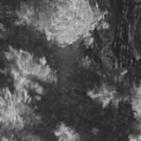
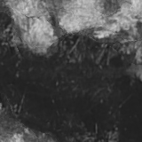
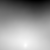
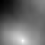

# convolution_direction_detection

As a part of UBC ELEC 221 project:
used cross correlation to determine the direction of a video footage

### Example results:

#### square flight path
 

 

#### triangle flight path
 

 
